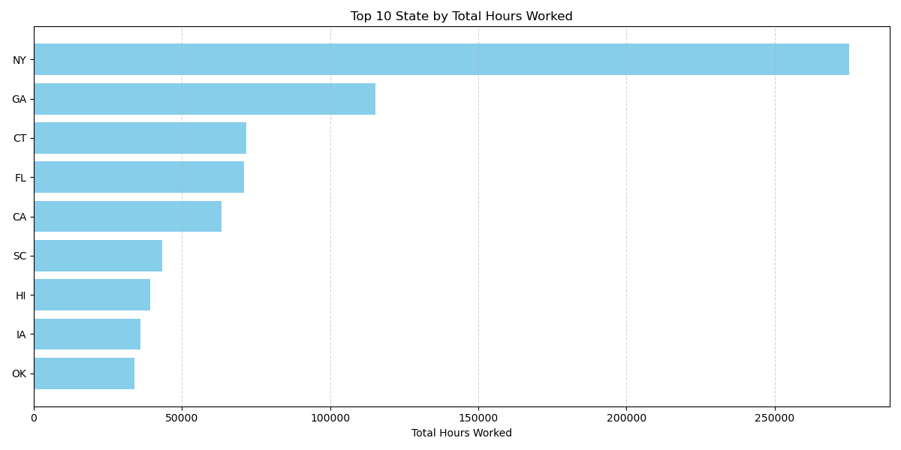
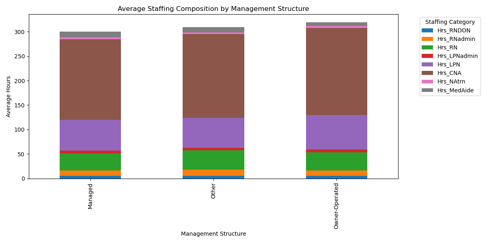
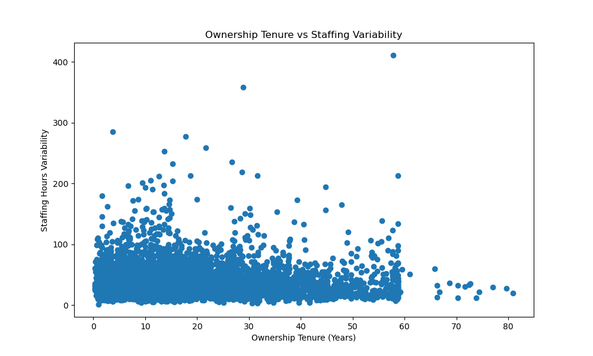

# Clipboard Health Sales Strategy Recommendations
## Introduction
The Centers for Medicaid and Medicare Services publish a quarterly report containing daily staffing data for all registered nursing homes in the U.S. This dataset is called Payroll Based Journal (PBJ) Daily Nurse Staffing
## Goal
Analyze the PBJ data and any other CMS data that could be see fit to make a few recommendations to the Clipboard Health sales leadership team
## Technologoies
- Jupyter lab
- Python
- libraries: Seaborn, Pandas, Matplotlib,

## Table of Contents
- [Recommendation 1: Leverage High Staffing Demand in New York City](#recommendation-1-leverage-high-staffing-demand-in-new-york-city)
- [Recommendation 2: Promote the App during Peak Bed Utilization Periods](#recommendation-2-promote-the-app-during-peak-bed-utilization-periods)
- [Recommendation 3: Market the App as a Real-Time Staffing Optimization Tool](#recommendation-3-market-the-app-as-a-real-time-staffing-optimization-tool)
- [Recommendation 4: Prioritize CNA and LPN Recruitment to Meet Demand Peak](#recommendation-4-prioritize-cna-and-lpn-recruitment-to-meet-demand-peak)
- [Recommendation 5: Target Facilities Needing Flexible and Consistent Staffing Solutions](#rTarget-Facilities-Needing-Flexible-and-Consistent-Staffing-Solutions)

---

### Recommendation 1: Leverage High Staffing Demand in New York City

## Observation:
While Ohio (OH) has the largest number of nursing facilities (see Chart 1.1), New York City (NYC) exhibits the highest staffing demand in terms of total hours worked (see Charts 1.2 and 1.3). NYC facilities also have higher average occupancy rates (see Chart 1.4), indicating greater staff utilization. Although Ohio leads in facility numbers, individual facilities in NYC require more staffing hours and operate at higher capacity. Notably, 8 of the top 10 facilities by total working hours are located in New York, further highlighting the city's significant staffing needs. Interestingly, the facility with the highest total hours is in Indiana (IN), despite IN ranking only 7th in the number of providers.
## Recommendation:
Clipboard Health should concentrate its sales efforts on densely populated regions like NYC, where the need for temporary staffing is highest due to staffing demands and high occupancy rates. The Clipboard Health app, which connects facilities with temporary staff, is particularly beneficial for cities like NYC, where flexibility and rapid staff fulfillment are crucial. By quickly addressing staffing shortages, the app allows facilities to maintain high-quality care during peak demand periods and meet regulatory staffing requirements.
## Market Focus:
*** For sales and marketing efforts, target high-demand regions like NYC, focusing on facilities with high occupancy rates and recurring staffing shortages. These facilities require flexible, fast-response staffing solutions to manage their ongoing challenges and meet patient care and regulatory standards**.

### Supporting Data

---

### Recommendation 2: Promote the App during Peak Bed Utilization Periods
## Observation:
During the first two weeks of January, the data reveals a steady increase in active beds (MDScensus), indicating a surge in patient occupancy across facilities (see Chart 2.1). This trend likely aligns with seasonal peaks in healthcare demand, such as post-holiday admissions or flu season. Additionally, the data shows a significant decrease in weekend occupancy, which becomes more pronounced by the end of the year's first quarter (see Chart 2.2). This highlights the variability in staffing needs during this period.
### Recommendation:
Clipboard Health should capitalize on this trend by promoting the app as a high-availability staffing solution that provides reliable, on-demand support during periods of increased patient occupancy. Marketing efforts should highlight the app's ability to quickly deliver dependable staff, ensuring facilities can handle surges in occupancy without compromising care quality. The app can instill confidence among healthcare administrators in its effectiveness during critical times by emphasizing reliability and swift responsiveness**.
Occupancy Trends: The MDScensus data for early January shows an upward trend in active bed usage, signaling increased patient admissions. Facilities are likely to face staffing challenges during these busy periods, making it essential to have a flexible and rapid-response solution readily available.
### Market Focus:
*** Target facilities that experience seasonal surges in patient occupancy, particularly during January. Emphasize the app’s capability to ensure a steady flow of qualified staff, thus reducing the risk of understaffing during peak times. By positioning the app as a trusted resource for high-demand periods, Clipboard Health can assist facilities in avoiding staffing shortages that often accompany high patient loads, ultimately enhancing operational efficiency and patient care quality.***
- 
- - 

---

## Recommendation 3: Market the App as a Real-Time Staffing Optimization Tool
## Observation:
Nursing facilities frequently struggle to maintain the optimal balance of Certified Nursing Assistants (CNAs), Registered Nurses (RNs), and Licensed Practical Nurses (LPNs). Overstaffing results in unnecessary costs, while understaffing compromises patient care quality and may lead to compliance issues. The data indicates a high density of CNAs, with their staffing levels positively correlating with RNs and LPNs. However, shortages arise when resident demand (as shown by the MDScensus) spikes between 500 and 700 residents, creating gaps that need to be filled (see Chart 3).
## Recommendation:
Promote Clipboard Health’s app as a real-time staffing optimization solution, enabling facilities to monitor and adjust staffing levels dynamically. By leveraging this tool, administrators can fine-tune their workforce mix, ensuring they have the correct ratio of CNAs, RNs, and LPNs to meet patient care requirements while avoiding excess labor costs. The app’s flexibility allows facilities to respond quickly to sudden increases in demand, reduce the risk of overstaffing, and improve overall operational efficiency, leading to better patient outcomes.
## Market Focus:
1. *** Based on the observations, Clipboard Health should focus on nursing facilities struggling with staffing imbalances, particularly in high-demand periods where resident census spikes (e.g., MDScensus between 500 and 700). Facilities in regions with high CNA, RN, and LPN staffing correlations are ideal targets, as they require dynamic, real-time adjustments to avoid overstaffing or critical shortages.**
2. **Emphasize the app’s capability to optimize the workforce, ensuring the correct staffing ratios in real-time to minimize costs and improve care outcomes. Areas with high average occupancy (see chart 1.4) tend to experience higher staffing demands and should be priority markets.**

### Supporting Data
- 

---

## Recommendation 4: Prioritize CNA and LPN Recruitment to Meet Demand Peak

### Observation:
Certified Nursing Assistants (CNAs) account for over 55.4% of total working hours, making them the largest staffing target (see Chart 4). Licensed Practical Nurses (LPNs) represent the second-highest demand. Both roles are essential for maintaining smooth operations in nursing facilities, particularly during periods of peak demand. Also, management structure does not significantly impact the high demand for CNAs, LPNs, or Registered Nurses (RNs) (see Chart 4.2). This indicates that regardless of facility ownership or management, the demand for these critical roles remains consistently high
###Recommendation:
Given their significant share of working hours, focus on recruiting and onboarding more CNAs as the primary staffing target. Additionally, ensure a steady supply of LPNs to meet the growing nursing facility demand. Implement strategies prioritizing the availability of both CNAs and LPNs, especially during peak periods, to ensure facilities can continue providing high-quality care without disruptions.
### Market Focus:
1.	**Target Facilities with High CNA Demand: Emphasize Clipboard Health's ability to provide a consistent supply of CNAs, helping facilities avoid staffing shortages and ensure regulatory compliance**.
2.	**Position LPNs as the Second Priority: Facilities rely heavily on LPNs, particularly in patient care. Promote the app's flexibility to meet both CNA and LPN staffing needs in real-time. By focusing on these high-demand roles, the sales team can better understand healthcare facilities' most pressing needs and maximize market penetration.**

### Supporting Data
- 
- 

---

## Recommendation 5: Target Facilities Needing Flexible and Consistent Staffing Solutions
### Observation:
The data shows that contractor hours remain steady while employee hours fluctuate, indicating that contractors and full-time employees serve distinct roles in healthcare staffing. Contractors offer consistent support during high and low-demand periods without directly replacing full-time employees (see Chart 5.1). Furthermore, analysis of the "NH_Ownership_Sep2024" dataset reveals that organization-owned facilities and those with shorter ownership tenures (less than 10 years) experience greater variability in staffing hours, often facing periods of intense demand (see Chart 5.2). These facilities are more susceptible to sudden staffing peaks, highlighting the need for flexible and adaptable staffing solutions.
In contrast, longer-tenure facilities display more stability in their staffing needs but could still benefit from improved workforce management tools. Additionally, analysis of the "NH_Providers_Info_Sep2024" dataset suggests that nonprofit and for-profit facilities experience similar variability in staffing needs despite having comparable median working hours across all facility types (see Chart 5.3). This consistency in median staffing hours points to a baseline level of staffing requirements, regardless of the variability in demand across different ownership structures.

### Recommendation:
Sales efforts should focus on promoting Clipboard Health’s app as a consistent and adaptable staffing solution, particularly for organization-owned new facilities and government facilitates. These facilities frequently face unpredictable staffing needs and could benefit from a platform that maintains a steady supply of contractors. The app should be positioned as a tool that complements full-time staff, providing on-demand workforce flexibility during fluctuating employee hours and ensuring facilities can respond to peaks in demand efficiently.

### Market Focus:
**Target organization-owned facilities, especially those with shorter ownership tenures and those experiencing staffing fluctuations. Emphasize the app’s ability to provide consistent contractor support to supplement full-time employees, offering a reliable staffing solution during high and low-demand periods. This flexibility helps facilities maintain quality care without the risks of over- or understaffing**.

### Supporting Data
- 
- 
- 
- 

---

### Supporting Data & Resources
- PBJ_Daily_Nurse_Staffing_2024Q1
- NH_Ownership_Sep2024
- NH_Providers_Info_Sep2024
- https://data.cms.gov/provider-data/search?theme=Nursing%20homes%20including%20rehab%20services
---
